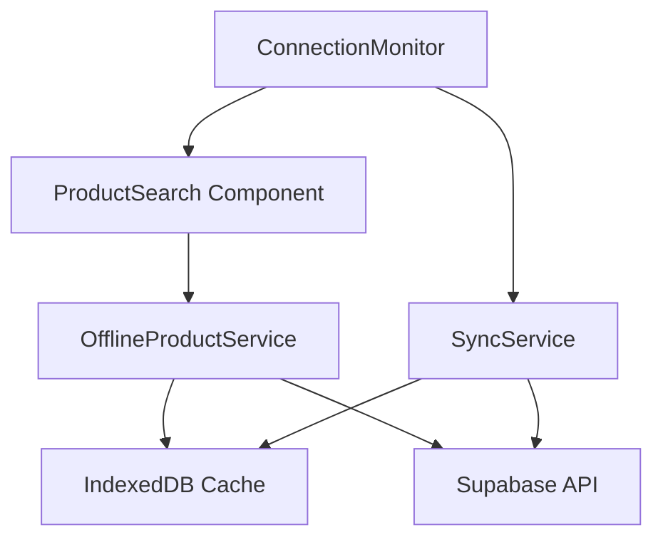

# Design Document

## Overview

This design implements a robust offline product search system for the PDV (Point of Sale) application. The solution leverages IndexedDB for local storage, implements intelligent caching strategies, and provides seamless fallback from online to offline search functionality. The design ensures that sales operations can continue uninterrupted even during network connectivity issues.

## Architecture

The offline product search system follows a layered architecture:

1. **Presentation Layer**: ProductSearch component with offline-aware UI
2. **Service Layer**: Enhanced OfflineProductService with search capabilities
3. **Data Layer**: IndexedDB with optimized indexes for fast search
4. **Synchronization Layer**: Background sync service for cache management



## Components and Interfaces

### Enhanced OfflineProductService

```javascript
class OfflineProductService {
  // Core search functionality
  async searchProducts(query, options = {})
  async searchProductsOffline(query, options = {})
  async searchProductsOnline(query, options = {})
  
  // Cache management
  async cacheAllProducts()
  async updateProductCache(products)
  async clearExpiredCache()
  
  // Synchronization
  async syncProductCache()
  async getLastSyncTimestamp()
  async setLastSyncTimestamp(timestamp)
}
```

### ProductSearch Component Enhancements

```javascript
// New props and state for offline functionality
const [isOffline, setIsOffline] = useState(!navigator.onLine)
const [cacheStatus, setCacheStatus] = useState('unknown')
const [searchSource, setSearchSource] = useState('online')
```

### Search Index Structure

IndexedDB will maintain multiple indexes for efficient searching:
- Primary index: `id`
- Search indexes: `name`, `barcode`, `sku`, `name_normalized`
- Composite index: `[category, name]` for category-based searches
- Timestamp index: `last_updated` for cache management

## Data Models

### Cached Product Model

```javascript
{
  id: string,
  name: string,
  name_normalized: string, // Lowercase, no accents for fuzzy search
  sku: string,
  barcode: string,
  sale_price: number,
  stock_quantity: number,
  unit_type: string,
  category: string,
  image_url: string,
  last_updated: timestamp,
  search_keywords: string[] // Additional searchable terms
}
```

### Cache Metadata Model

```javascript
{
  key: 'cache_metadata',
  last_full_sync: timestamp,
  last_partial_sync: timestamp,
  total_products: number,
  cache_size_mb: number,
  version: string
}
```

## Correctness Properties

*A property is a characteristic or behavior that should hold true across all valid executions of a system-essentially, a formal statement about what the system should do. Properties serve as the bridge between human-readable specifications and machine-verifiable correctness guarantees.*

### Property Reflection

After reviewing all properties identified in the prework, several can be consolidated to eliminate redundancy:

- Properties 4.2 and 4.3 (barcode and SKU exact matching) can be combined into a single "exact field matching" property
- Properties 3.1, 3.2, and 3.3 (UI indicators) can be combined into a comprehensive "status indication" property  
- Properties 2.1, 2.3, and 2.5 (timing-based behaviors) can be grouped as they all test temporal consistency
- Properties 5.1 and 5.2 (cache initialization and data completeness) can be combined into a "cache integrity" property

The following properties provide unique validation value and will be implemented:

Property 1: Offline search uses cache exclusively
*For any* search query when the system is offline, all results should come from the Product_Cache and no network requests should be made
**Validates: Requirements 1.1**

Property 2: Search performance consistency  
*For any* search query performed offline, the response time should be under 500ms
**Validates: Requirements 1.2**

Property 3: Automatic cache population
*For any* transition from online to offline mode, all available products should be automatically cached to local storage
**Validates: Requirements 1.3**

Property 4: Cache status indication
*For any* search operation, the UI should correctly indicate whether results are from cache, online, or if there are cache issues
**Validates: Requirements 1.4, 3.1, 3.2, 3.3**

Property 5: Periodic cache synchronization
*For any* time period when the system is online, cache updates should occur at the specified intervals (30 minutes for automatic, immediate for modifications)
**Validates: Requirements 2.1, 2.2, 2.3**

Property 6: Cache size management
*For any* cache state, when storage limits are exceeded, the system should implement cleanup strategies to maintain performance
**Validates: Requirements 2.4, 5.3**

Property 7: Sync retry consistency
*For any* failed synchronization attempt while online, the system should retry at 5-minute intervals
**Validates: Requirements 2.5**

Property 8: Connectivity status feedback
*For any* connectivity change, the system should provide appropriate user feedback and initiate necessary actions
**Validates: Requirements 3.4, 3.5**

Property 9: Fuzzy search accuracy
*For any* product name search in offline mode, the fuzzy matching should achieve at least 80% accuracy for relevant results
**Validates: Requirements 4.1**

Property 10: Exact field matching
*For any* barcode or SKU search in offline mode, the system should return exact matches from the cache
**Validates: Requirements 4.2, 4.3**

Property 11: Multi-term search logic
*For any* search with multiple terms, the system should return products matching any of the provided terms
**Validates: Requirements 4.4**

Property 12: Result limiting consistency
*For any* search returning more than 10 results, the system should limit output to the 10 most relevant matches
**Validates: Requirements 4.5**

Property 13: Cache integrity maintenance
*For any* cache initialization or product storage operation, the system should maintain proper IndexedDB structure and complete data fields
**Validates: Requirements 5.1, 5.2**

Property 14: Error recovery robustness
*For any* cache corruption or missing data scenario, the system should gracefully recover and rebuild the cache
**Validates: Requirements 5.4, 5.5**

## Error Handling

### Network Connectivity Errors
- Graceful degradation when transitioning to offline mode
- Automatic retry mechanisms for failed synchronization
- User notification of connectivity status changes

### Cache Corruption Handling
- Detection of corrupted IndexedDB data
- Automatic cache clearing and rebuilding
- Fallback to online mode when cache is unavailable

### Storage Quota Exceeded
- Proactive monitoring of storage usage
- LRU (Least Recently Used) cleanup strategy
- User notification when storage is critically low

### Search Performance Degradation
- Timeout handling for slow search operations
- Progressive search result loading for large datasets
- Fallback to simpler search algorithms if needed

## Testing Strategy

### Unit Testing Approach
Unit tests will focus on:
- Individual search algorithm components
- Cache management operations
- Error handling scenarios
- UI component behavior in different states

### Property-Based Testing Approach
Property-based tests will use **fast-check** library for JavaScript and run a minimum of 100 iterations per property. Each test will be tagged with the format: **Feature: offline-product-search, Property {number}: {property_text}**

Property-based tests will verify:
- Search consistency across random input sets
- Cache behavior under various data conditions
- Performance characteristics across different scenarios
- Error recovery mechanisms with random failure conditions

The dual testing approach ensures comprehensive coverage: unit tests catch specific bugs and edge cases, while property tests verify general correctness across the entire input space.

### Test Data Generation
- Random product datasets with varying characteristics
- Simulated network conditions (online/offline transitions)
- Various cache states (empty, full, corrupted)
- Different search query patterns and complexities

## Implementation Phases

### Phase 1: Core Cache Infrastructure
- Enhance OfflineProductService with search capabilities
- Implement IndexedDB schema with optimized indexes
- Add basic cache population and retrieval

### Phase 2: Search Implementation
- Implement offline search algorithms (exact and fuzzy matching)
- Add search performance optimizations
- Integrate with existing ProductSearch component

### Phase 3: Synchronization Logic
- Implement periodic cache updates
- Add conflict resolution for concurrent modifications
- Implement retry mechanisms for failed syncs

### Phase 4: User Experience Enhancements
- Add offline status indicators
- Implement progress feedback for sync operations
- Add cache management user controls

### Phase 5: Performance Optimization
- Implement cache size management
- Add search result ranking algorithms
- Optimize IndexedDB query performance